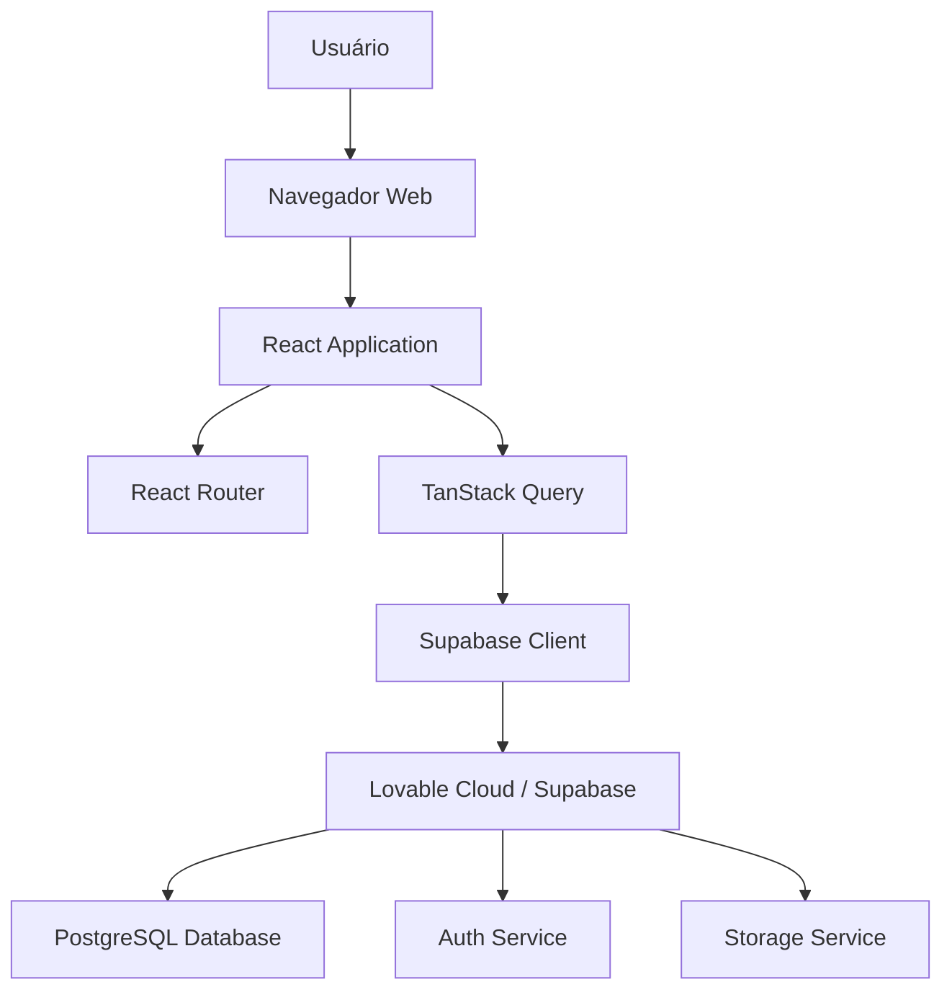
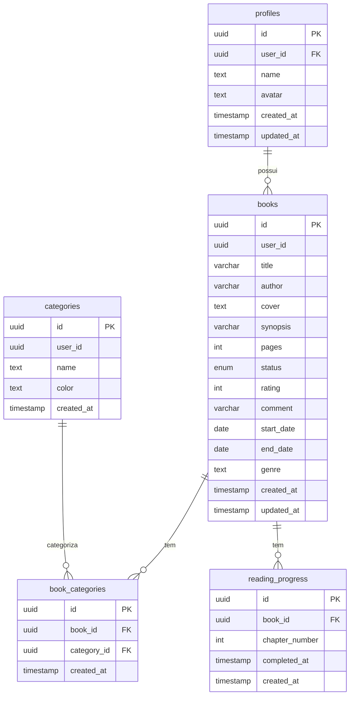

# Documentação Técnica - Booksfy

**Versão:** 1.0  
**Data:** 15 de novembro de 2025  
**Projeto:** Sistema de Gerenciamento de Biblioteca Pessoal

---

## 1. Introdução

### 1.1 Objetivo da Documentação
Esta documentação técnica tem como objetivo fornecer uma visão detalhada da arquitetura, implementação e decisões técnicas do projeto Booksfy. É destinada a desenvolvedores que precisam entender, manter ou expandir o sistema.

### 1.2 Público-Alvo
- Desenvolvedores frontend e fullstack
- Engenheiros de software
- Arquitetos de sistemas
- DevOps e equipes de infraestrutura

### 1.3 Versão do Sistema
- **Frontend:** v1.0.0
- **Backend:** Lovable Cloud (Supabase)
- **Build:** Vite 5.4.19
- **Node.js:** 18+ (LTS)

---

## 2. Arquitetura do Sistema

### 2.1 Visão Geral

O Booksfy segue uma arquitetura moderna de **Single Page Application (SPA)** baseada em componentes React, com backend serverless gerenciado pelo Lovable Cloud (Supabase).



### 2.2 Padrão Arquitetural

**Component-Based Architecture (React):**
- **Presentation Layer:** Componentes UI (React + shadcn/ui)
- **Business Logic Layer:** Custom hooks e Context API
- **Data Access Layer:** TanStack Query + Supabase Client

### 2.3 Fluxo de Dados

```
Usuário → Interação UI → React Component → 
→ React Hook Form (validação) → 
→ TanStack Query (mutation) → 
→ Supabase Client → 
→ Lovable Cloud → 
→ PostgreSQL (RLS aplicado) → 
→ Response → Cache → UI Update
```

**Características:**
- Fluxo unidirecional de dados
- State management reativo
- Cache inteligente (TanStack Query)
- Validação em múltiplas camadas

---

## 3. Estrutura de Pastas

```
booksfy/
├── src/
│   ├── components/              # Componentes React
│   │   ├── ui/                 # 40+ componentes shadcn/ui
│   │   │   ├── accordion.tsx
│   │   │   ├── alert-dialog.tsx
│   │   │   ├── avatar.tsx
│   │   │   ├── button.tsx
│   │   │   ├── card.tsx
│   │   │   ├── dialog.tsx
│   │   │   ├── input.tsx
│   │   │   ├── select.tsx
│   │   │   └── ... (outros 32 componentes)
│   │   ├── AddBookModal.tsx    # Modal adicionar/editar livro
│   │   ├── BookCard.tsx        # Card visual de cada livro
│   │   ├── BookDetailsModal.tsx # Modal de detalhes/edição
│   │   ├── CharacterCounter.tsx # Contador de caracteres
│   │   ├── GenreSelect.tsx     # Select de gêneros
│   │   ├── Header.tsx          # Navegação principal
│   │   ├── Library.tsx         # Lista de livros
│   │   ├── LibraryFilters.tsx  # Sistema de filtros
│   │   ├── LibrarySkeleton.tsx # Loading state
│   │   ├── Profile.tsx         # Perfil do usuário
│   │   └── Statistics.tsx      # Estatísticas visuais
│   ├── pages/                  # Páginas principais
│   │   ├── Index.tsx           # Dashboard (home autenticado)
│   │   ├── Auth.tsx            # Login/Signup/Recuperação
│   │   ├── Landing.tsx         # Landing page pública
│   │   └── NotFound.tsx        # Página 404
│   ├── contexts/               # React Context API
│   │   └── AppContext.tsx      # Auth state management
│   ├── hooks/                  # Custom hooks
│   │   ├── use-mobile.tsx      # Detecta viewport mobile
│   │   └── use-toast.ts        # Toast notifications
│   ├── integrations/           # Integrações externas
│   │   └── supabase/
│   │       ├── client.ts       # Cliente Supabase (auto-gerado)
│   │       └── types.ts        # Tipos TypeScript (auto-gerado)
│   ├── lib/                    # Utilidades
│   │   └── utils.ts            # Helper functions (cn, etc.)
│   ├── App.tsx                 # Componente raiz
│   ├── main.tsx                # Entry point
│   └── index.css               # Estilos globais + design tokens
├── supabase/
│   ├── migrations/             # 15+ migrações SQL
│   │   ├── 20240101000000_initial_schema.sql
│   │   ├── 20240102000000_create_profiles.sql
│   │   ├── 20240103000000_create_books.sql
│   │   └── ... (outras migrações)
│   └── config.toml             # Configuração (auto-gerado)
├── docs/                       # Documentação
│   ├── 01_Escopo_Projeto_Booksfy.md
│   ├── 02_Metricas_Qualidade_Booksfy.md
│   ├── 03_Documentacao_Tecnica_Booksfy.md (este arquivo)
│   ├── Briefing_e_Benchmarking.md
│   └── Requisitos_Funcionais_e_Nao_Funcionais.md
├── public/                     # Arquivos estáticos
│   ├── favicon.ico
│   ├── robots.txt
│   └── placeholder.svg
├── .env                        # Variáveis de ambiente (não commitado)
├── package.json                # Dependências
├── tsconfig.json               # Configuração TypeScript
├── tailwind.config.ts          # Configuração Tailwind
├── vite.config.ts              # Configuração Vite
└── README.md                   # Readme do projeto
```

---

## 4. Stack Tecnológico Detalhado

### 4.1 Frontend Core

| Tecnologia | Versão | Propósito |
|------------|--------|-----------|
| **React** | 18.3.1 | Biblioteca para construção de interfaces |
| **TypeScript** | 5.8.3 | Type safety e autocompletion |
| **Vite** | 5.4.19 | Build tool ultra-rápido |
| **React Router DOM** | 6.30.1 | Roteamento SPA |

**Por que React?**
- Componentização
- Virtual DOM (performance)
- Ecossistema maduro
- Hooks modernos

**Por que TypeScript?**
- Detecção de erros em tempo de desenvolvimento
- IntelliSense melhorado
- Refatoração segura
- Documentação implícita via tipos

**Por que Vite?**
- HMR instantâneo
- Build otimizado (Rollup)
- ES Modules nativos
- Suporte TypeScript out-of-the-box

### 4.2 UI e Styling

| Tecnologia | Versão | Propósito |
|------------|--------|-----------|
| **Tailwind CSS** | 3.4.17 | Utility-first CSS framework |
| **shadcn/ui** | - | Design system (40+ componentes) |
| **Radix UI** | 1.x | Componentes headless acessíveis |
| **lucide-react** | 0.462.0 | Biblioteca de ícones |
| **class-variance-authority** | 0.7.1 | Variantes de componentes |
| **tailwind-merge** | 2.6.0 | Merge de classes Tailwind |
| **tailwindcss-animate** | 1.0.7 | Animações Tailwind |

**Design System:**
- Baseado em shadcn/ui (Radix UI + Tailwind)
- Componentes totalmente customizáveis
- Acessibilidade WCAG AA
- Tema dark/light mode

### 4.3 State Management

| Tecnologia | Versão | Propósito |
|------------|--------|-----------|
| **TanStack Query** | 5.83.0 | Server state management |
| **React Context API** | (React 18) | Client state management |

**TanStack Query (React Query):**
- Cache automático
- Refetch inteligente
- Optimistic updates
- Invalidação de queries
- Retry logic

**Context API:**
- Auth state (user, session)
- Global UI state
- Loading states

### 4.4 Formulários e Validação

| Tecnologia | Versão | Propósito |
|------------|--------|-----------|
| **React Hook Form** | 7.61.1 | Gerenciamento de formulários |
| **Zod** | 3.25.76 | Schema validation |
| **@hookform/resolvers** | 3.10.0 | Integração Zod + RHF |

**Por que React Hook Form?**
- Performance (uncontrolled components)
- API simples e intuitiva
- Validação eficiente
- Integração com Zod

**Zod Schemas Implementados:**
```typescript
// authSchema (Auth.tsx)
email: z.string().email()
password: z.string().min(6)

// bookSchema (AddBookModal.tsx)
title: z.string().trim().min(1).max(128)
author: z.string().trim().min(1).max(64)
synopsis: z.string().max(1024).optional()
pages: z.number().int().positive().max(9999).optional()
status: z.enum(['want_to_read', 'reading', 'read'])
rating: z.number().min(0).max(5).optional()
comment: z.string().max(500).optional()
```

### 4.5 Backend e Database

| Tecnologia | Versão | Propósito |
|------------|--------|-----------|
| **Lovable Cloud** | - | Backend serverless (Supabase) |
| **@supabase/supabase-js** | 2.58.0 | Cliente JavaScript |
| **PostgreSQL** | 15+ | Banco de dados relacional |

**Lovable Cloud Features:**
- Database (PostgreSQL)
- Authentication (Supabase Auth)
- Row Level Security (RLS)
- Storage (futuro)
- Edge Functions (futuro)

### 4.6 Gráficos e Visualizações

| Tecnologia | Versão | Propósito |
|------------|--------|-----------|
| **Recharts** | 2.15.4 | Biblioteca de gráficos React |

**Gráficos Implementados:**
- BarChart (livros por status)
- PieChart (distribuição de avaliações)
- LineChart (progresso de leitura)

### 4.7 Utilitários

| Tecnologia | Versão | Propósito |
|------------|--------|-----------|
| **date-fns** | 3.6.0 | Manipulação de datas |
| **clsx** | 2.1.1 | Conditional classNames |
| **sonner** | 1.7.4 | Toast notifications |

---

## 5. Modelo de Banco de Dados

### 5.1 Diagrama Entidade-Relacionamento



### 5.2 Tabela: profiles

Armazena informações adicionais dos usuários.

| Coluna | Tipo | Constraints | Descrição |
|--------|------|-------------|-----------|
| id | uuid | PK, DEFAULT gen_random_uuid() | ID único do perfil |
| user_id | uuid | NOT NULL, UNIQUE | FK para auth.users (Supabase Auth) |
| name | text | NOT NULL | Nome de exibição do usuário |
| avatar | text | NULL | URL do avatar |
| created_at | timestamp | DEFAULT now() | Data de criação |
| updated_at | timestamp | DEFAULT now() | Data de última atualização |

**Índices:**
- PRIMARY KEY (id)
- UNIQUE (user_id)

**RLS Policies:**
```sql
-- Usuários podem visualizar seus próprios perfis
CREATE POLICY "Users can view own profile"
ON profiles FOR SELECT
USING (auth.uid() = user_id);

-- Usuários podem atualizar seus próprios perfis
CREATE POLICY "Users can update own profile"
ON profiles FOR UPDATE
USING (auth.uid() = user_id);
```

### 5.3 Tabela: books

Armazena todos os livros cadastrados pelos usuários.

| Coluna | Tipo | Constraints | Descrição |
|--------|------|-------------|-----------|
| id | uuid | PK, DEFAULT gen_random_uuid() | ID único do livro |
| user_id | uuid | NOT NULL | ID do usuário dono do livro |
| title | varchar(128) | NOT NULL | Título do livro |
| author | varchar(64) | NOT NULL | Autor do livro |
| cover | text | NULL | URL da capa |
| synopsis | varchar(1024) | NULL | Sinopse do livro |
| pages | integer | NULL | Número de páginas |
| status | enum | NOT NULL | want_to_read, reading, read |
| rating | integer | NULL, CHECK (0-5) | Avaliação de 0-5 estrelas |
| comment | varchar(500) | NULL | Comentário pessoal |
| start_date | date | NULL | Data de início da leitura |
| end_date | date | NULL | Data de término da leitura |
| genre | text | NULL | Gênero literário |
| created_at | timestamp | DEFAULT now() | Data de criação |
| updated_at | timestamp | DEFAULT now() | Data de última atualização |

**Índices:**
- PRIMARY KEY (id)
- INDEX (user_id)
- INDEX (status)
- INDEX (created_at DESC)

**RLS Policies:**
```sql
-- Usuários podem visualizar seus próprios livros
CREATE POLICY "Users can view own books"
ON books FOR SELECT
USING (auth.uid() = user_id);

-- Usuários podem inserir seus próprios livros
CREATE POLICY "Users can insert own books"
ON books FOR INSERT
WITH CHECK (auth.uid() = user_id);

-- Usuários podem atualizar seus próprios livros
CREATE POLICY "Users can update own books"
ON books FOR UPDATE
USING (auth.uid() = user_id);

-- Usuários podem deletar seus próprios livros
CREATE POLICY "Users can delete own books"
ON books FOR DELETE
USING (auth.uid() = user_id);
```

### 5.4 Tabela: categories

Categorias personalizadas criadas pelos usuários.

| Coluna | Tipo | Constraints | Descrição |
|--------|------|-------------|-----------|
| id | uuid | PK, DEFAULT gen_random_uuid() | ID único da categoria |
| user_id | uuid | NOT NULL | ID do usuário dono da categoria |
| name | text | NOT NULL | Nome da categoria |
| color | text | NOT NULL | Cor hexadecimal |
| created_at | timestamp | DEFAULT now() | Data de criação |

**RLS Policies:**
- Similar à tabela books (user-scoped)

### 5.5 Tabela: book_categories

Relacionamento N:N entre livros e categorias.

| Coluna | Tipo | Constraints | Descrição |
|--------|------|-------------|-----------|
| id | uuid | PK, DEFAULT gen_random_uuid() | ID único |
| book_id | uuid | NOT NULL, FK | ID do livro |
| category_id | uuid | NOT NULL, FK | ID da categoria |
| created_at | timestamp | DEFAULT now() | Data de criação |

**Foreign Keys:**
- book_id → books(id) ON DELETE CASCADE
- category_id → categories(id) ON DELETE CASCADE

### 5.6 Tabela: reading_progress

Progresso de leitura por capítulos.

| Coluna | Tipo | Constraints | Descrição |
|--------|------|-------------|-----------|
| id | uuid | PK, DEFAULT gen_random_uuid() | ID único |
| book_id | uuid | NOT NULL, FK | ID do livro |
| chapter_number | integer | NOT NULL | Número do capítulo |
| completed_at | timestamp | NULL | Data de conclusão |
| created_at | timestamp | DEFAULT now() | Data de criação |

**Foreign Keys:**
- book_id → books(id) ON DELETE CASCADE

### 5.7 Triggers e Functions

**Function: update_updated_at_column()**
```sql
CREATE OR REPLACE FUNCTION public.update_updated_at_column()
RETURNS TRIGGER AS $$
BEGIN
  NEW.updated_at = now();
  RETURN NEW;
END;
$$ LANGUAGE plpgsql SET search_path TO 'public';
```

**Trigger: update_books_updated_at**
```sql
CREATE TRIGGER update_books_updated_at
BEFORE UPDATE ON public.books
FOR EACH ROW
EXECUTE FUNCTION public.update_updated_at_column();
```

**Function: handle_new_user()**
```sql
CREATE OR REPLACE FUNCTION public.handle_new_user()
RETURNS TRIGGER AS $$
BEGIN
  INSERT INTO public.profiles (user_id, name)
  VALUES (NEW.id, NEW.email);
  RETURN NEW;
END;
$$ LANGUAGE plpgsql SET search_path TO 'public';
```

**Trigger: on_auth_user_created**
```sql
CREATE TRIGGER on_auth_user_created
AFTER INSERT ON auth.users
FOR EACH ROW
EXECUTE FUNCTION public.handle_new_user();
```

---

## 6. Autenticação e Autorização

### 6.1 Fluxo de Autenticação

**1. Signup (Cadastro):**
```
Usuário → Formulário (email + senha) →
→ Validação Zod (client-side) →
→ supabase.auth.signUp() →
→ Supabase Auth cria usuário →
→ Email de confirmação enviado (opcional) →
→ Trigger handle_new_user() cria perfil →
→ Session token retornado →
→ Redirect para /home
```

**2. Login:**
```
Usuário → Formulário (email + senha) →
→ Validação Zod →
→ supabase.auth.signInWithPassword() →
→ Supabase Auth verifica credenciais →
→ Session token retornado →
→ AppContext atualiza user state →
→ Redirect para /home
```

**3. Recuperação de Senha:**
```
Usuário → Formulário (email) →
→ supabase.auth.resetPasswordForEmail() →
→ Supabase envia email com link →
→ Usuário clica link →
→ Redirect para página de reset →
→ Nova senha definida →
→ supabase.auth.updateUser()
```

**4. Logout:**
```
Usuário → Clica "Sair" →
→ supabase.auth.signOut() →
→ Session limpa →
→ AppContext limpa user state →
→ Redirect para /auth
```

### 6.2 Gerenciamento de Sessão

**AppContext.tsx:**
```typescript
const [user, setUser] = useState<User | null>(null);
const [session, setSession] = useState<Session | null>(null);
const [loading, setLoading] = useState(true);

useEffect(() => {
  // Listener para mudanças de auth
  const { data: { subscription } } = supabase.auth.onAuthStateChange(
    (_event, session) => {
      setSession(session);
      setUser(session?.user ?? null);
      setLoading(false);
    }
  );

  return () => subscription.unsubscribe();
}, []);
```

**Proteção de Rotas (Index.tsx):**
```typescript
if (loading) return <Skeleton />;
if (!user) return <Navigate to="/auth" />;
return <Dashboard />;
```

### 6.3 Row Level Security (RLS)

Todas as tabelas possuem RLS ativo, garantindo isolamento completo de dados por usuário.

**Exemplo (books):**
```sql
ALTER TABLE books ENABLE ROW LEVEL SECURITY;

CREATE POLICY "Users can view own books"
ON books FOR SELECT
USING (auth.uid() = user_id);
```

**Como funciona:**
1. Usuário faz query: `SELECT * FROM books`
2. PostgreSQL aplica RLS automaticamente
3. Query transformada: `SELECT * FROM books WHERE user_id = auth.uid()`
4. Retorna apenas livros do usuário autenticado

**Benefícios:**
- Segurança no nível do banco de dados
- Impossível acessar dados de outros usuários (mesmo com query manual)
- Zero trust no cliente

---

## 7. Componentes Principais

### 7.1 Pages

#### Index.tsx (Dashboard)
**Responsabilidades:**
- Gerencia views principais (library, statistics, profile)
- Verifica autenticação
- Renderiza Header + view ativa

**State:**
```typescript
const [view, setView] = useState<'library' | 'statistics' | 'profile'>('library');
```

**Fluxo:**
```
Index.tsx monta →
→ Verifica user (AppContext) →
→ Se autenticado: renderiza Dashboard →
→ Se não: redirect /auth →
→ User navega entre views via Header
```

#### Auth.tsx (Autenticação)
**Responsabilidades:**
- Login, signup, recuperação de senha
- Formulários com validação Zod
- Integração com Supabase Auth

**State:**
```typescript
const [mode, setMode] = useState<'login' | 'signup' | 'reset'>('login');
```

#### Landing.tsx
**Responsabilidades:**
- Página pública de apresentação
- Hero section, features, footer
- CTA para signup

### 7.2 Components

#### Library.tsx
**Responsabilidades:**
- Listar todos os livros do usuário
- Aplicar filtros
- Gerenciar modais (AddBook, BookDetails)

**State:**
```typescript
const [books, setBooks] = useState<Book[]>([]);
const [filters, setFilters] = useState<Filters>({
  search: '',
  status: 'all',
  genres: [],
  rating: 0,
  startDate: null,
  endDate: null
});
const [selectedBook, setSelectedBook] = useState<Book | null>(null);
```

**Fluxo de Dados:**
```
Library.tsx monta →
→ useEffect → fetchBooks() →
→ supabase.from('books').select('*').order('created_at', { ascending: false }) →
→ RLS filtra automaticamente (user_id = auth.uid()) →
→ setBooks(data) →
→ filteredBooks = books.filter(applyFilters) →
→ Renderiza BookCard para cada livro
```

**Otimizações:**
- Debouncing em busca por texto (500ms)
- TanStack Query cache
- Skeleton loader durante fetch

#### LibraryFilters.tsx
**Responsabilidades:**
- UI de filtros (7 tipos)
- Comunicação via props com Library.tsx

**Filtros Implementados:**
1. **Busca por texto**: Input com debouncing
2. **Status**: Select (want_to_read, reading, read, all)
3. **Gêneros**: Multi-select
4. **Avaliação mínima**: Slider (0-5)
5. **Data de início (de/até)**: Date range picker
6. **Data de término (de/até)**: Date range picker

**Lógica de Aplicação:**
```typescript
const filteredBooks = books.filter(book => {
  // Busca por texto
  if (filters.search && !book.title.toLowerCase().includes(filters.search.toLowerCase()) 
      && !book.author.toLowerCase().includes(filters.search.toLowerCase())) {
    return false;
  }
  
  // Status
  if (filters.status !== 'all' && book.status !== filters.status) {
    return false;
  }
  
  // Gêneros
  if (filters.genres.length > 0 && !filters.genres.includes(book.genre)) {
    return false;
  }
  
  // Rating
  if (filters.rating > 0 && (book.rating ?? 0) < filters.rating) {
    return false;
  }
  
  // Datas (lógica similar)
  
  return true;
});
```

#### AddBookModal.tsx
**Responsabilidades:**
- Formulário para adicionar/editar livro
- 15 campos com validação
- Character counters em tempo real

**Schema Zod:**
```typescript
const bookSchema = z.object({
  title: z.string().trim().min(1, "Título é obrigatório").max(128),
  author: z.string().trim().min(1, "Autor é obrigatório").max(64),
  synopsis: z.string().max(1024).optional(),
  pages: z.number().int().positive().max(9999).optional(),
  status: z.enum(['want_to_read', 'reading', 'read']),
  rating: z.number().min(0).max(5).optional(),
  comment: z.string().max(500).optional(),
  start_date: z.string().optional(),
  end_date: z.string().optional(),
  genre: z.string().optional(),
  cover: z.string().url().optional()
});
```

**Fluxo de Submit:**
```
Usuário preenche formulário →
→ React Hook Form gerencia state →
→ onSubmit → Validação Zod →
→ Se inválido: exibe erros →
→ Se válido: supabase.from('books').insert(data) →
→ TanStack Query invalidateQueries(['books']) →
→ Toast de sucesso →
→ Modal fecha →
→ Library.tsx re-fetch automático (cache invalidation)
```

#### BookDetailsModal.tsx
**Responsabilidades:**
- Exibir detalhes completos do livro
- Editar livro
- Deletar livro (com confirmação)

**Modos:**
- **View:** Apenas visualização
- **Edit:** Formulário editável

#### Statistics.tsx
**Responsabilidades:**
- Calcular estatísticas de leitura
- Renderizar gráficos (Recharts)

**Métricas:**
- Total de livros
- Quero ler, lendo, lidos
- Média de avaliações
- Distribuição por status (gráfico)
- Distribuição por gênero (gráfico)

**Cálculos:**
```typescript
const totalBooks = books.length;
const wantToRead = books.filter(b => b.status === 'want_to_read').length;
const reading = books.filter(b => b.status === 'reading').length;
const read = books.filter(b => b.status === 'read').length;
const avgRating = books.reduce((sum, b) => sum + (b.rating ?? 0), 0) / totalBooks;
```

#### Profile.tsx
**Responsabilidades:**
- Exibir perfil do usuário
- Editar nome e avatar
- Mudar senha

---

## 8. Segurança Implementada

### 8.1 Vulnerabilidades Corrigidas

**1. Function Search Path Mutable (RESOLVIDO ✅)**

**Problema:**
Funções SQL sem `search_path` explícito podem ser exploradas para injeção de código.

**Solução:**
```sql
CREATE OR REPLACE FUNCTION public.update_updated_at_column()
RETURNS TRIGGER AS $$
BEGIN
  NEW.updated_at = now();
  RETURN NEW;
END;
$$ LANGUAGE plpgsql SET search_path TO 'public';
-- ^^ CRÍTICO: SET search_path TO 'public'
```

**2. Leaked Password Protection (PENDENTE ⚠️)**

**Problema:**
Proteção contra senhas vazadas não está ativa.

**Solução (manual):**
1. Acessar Supabase Dashboard
2. Authentication > Settings
3. Habilitar "Leaked Password Protection"

### 8.2 Input Sanitization

**Client-Side:**
- React JSX auto-escape (XSS protection)
- Zod validation (type coercion)
- Character limits em todos os campos

**Exemplo:**
```typescript
// SEGURO: React auto-escapa
<h1>{book.title}</h1>

// INSEGURO (não usado no projeto)
<div dangerouslySetInnerHTML={{ __html: userInput }} />
```

**Server-Side:**
- PostgreSQL prepared statements (Supabase Client)
- RLS policies (isolamento de dados)

### 8.3 Authentication Security

**Password Requirements:**
- Min 6 caracteres (client-side)
- Hashing automático (Supabase Auth - bcrypt)

**Session Security:**
- JWT tokens (Supabase)
- Refresh automático
- HttpOnly cookies (Supabase)
- Expiração configurável

### 8.4 RLS Policies (100% Cobertura)

Todas as 5 tabelas têm RLS ativo:
- ✅ profiles
- ✅ books
- ✅ categories
- ✅ book_categories
- ✅ reading_progress

**Política padrão:**
```sql
USING (auth.uid() = user_id)
WITH CHECK (auth.uid() = user_id)
```

---

## 9. Performance e Otimizações

### 9.1 Build Time

**Vite Optimizations:**
- Tree-shaking (elimina código não usado)
- Minificação (Terser)
- Code splitting (React Router lazy loading)
- CSS purging (Tailwind)

**Bundle Size:**
```
dist/index.html        ~2 KB
dist/assets/*.js       ~300 KB (gzipped ~100 KB)
dist/assets/*.css      ~15 KB (gzipped ~4 KB)
```

### 9.2 Runtime

**TanStack Query Cache:**
- Cache em memória
- Stale time: 5 minutos
- Refetch on window focus
- Retry logic (3 tentativas)

**Debouncing:**
```typescript
// LibraryFilters.tsx - busca por texto
const debouncedSearch = useMemo(
  () => debounce((value: string) => setFilters(prev => ({ ...prev, search: value })), 500),
  []
);
```

**Skeleton Loaders:**
- LibrarySkeleton.tsx (perceived performance)
- Melhora experiência durante loading

### 9.3 Network

**Supabase PostgREST:**
- Queries otimizadas automaticamente
- Select apenas campos necessários
- Indexação automática de FKs

**Exemplo:**
```typescript
// Eficiente: select apenas campos usados
const { data } = await supabase
  .from('books')
  .select('id, title, author, cover, status, rating')
  .order('created_at', { ascending: false });
```

---

## 10. Testes (Futuro)

### 10.1 Unit Tests
**Framework:** Jest + React Testing Library

**Cobertura desejada:**
- Componentes UI: 80%+
- Hooks customizados: 90%+
- Utilidades: 100%

**Exemplo:**
```typescript
// BookCard.test.tsx
describe('BookCard', () => {
  it('should render book title and author', () => {
    const book = { id: '1', title: 'Test', author: 'Author' };
    render(<BookCard book={book} />);
    expect(screen.getByText('Test')).toBeInTheDocument();
  });
});
```

### 10.2 Integration Tests
**Framework:** Cypress

**Cenários:**
- Fluxo completo de autenticação
- Adicionar/editar/deletar livro
- Aplicar filtros
- Visualizar estatísticas

### 10.3 E2E Tests
**Framework:** Playwright

**Cobertura:**
- User journeys completos
- Cross-browser testing
- Mobile testing

---

## 11. Deploy e CI/CD

### 11.1 Lovable Platform (Atual)

**Deploy Frontend:**
1. Clicar "Publish" na UI do Lovable
2. Escolher subdomínio (.lovable.app)
3. Deploy automático (30-60s)
4. Updates: Clicar "Update" no publish dialog

**Deploy Backend:**
- Migrações: Deploy automático imediato
- Edge Functions: Deploy automático imediato

**URL:** https://[subdominio].lovable.app

### 11.2 CI/CD Futuro (GitHub Actions)

**Workflow sugerido:**
```yaml
name: Deploy
on:
  push:
    branches: [main]
jobs:
  build:
    runs-on: ubuntu-latest
    steps:
      - uses: actions/checkout@v3
      - uses: actions/setup-node@v3
        with:
          node-version: 18
      - run: npm ci
      - run: npm run build
      - run: npm run test
      - name: Deploy to Vercel
        run: vercel --prod --token=${{ secrets.VERCEL_TOKEN }}
```

---

## 12. Manutenção e Troubleshooting

### 12.1 Logs

**Frontend (Browser):**
- Console do navegador (F12)
- React DevTools
- TanStack Query DevTools

**Backend (Supabase):**
- Supabase Dashboard > Logs
- Auth logs: Signups, logins, errors
- Database logs: Queries, slow queries
- API logs: Requests, errors

### 12.2 Problemas Comuns

**Erro: "Row Level Security policy violation"**
- **Causa:** RLS bloqueando query
- **Solução:** Verificar se user_id está correto

**Erro: "Network request failed"**
- **Causa:** Backend indisponível ou .env incorreto
- **Solução:** Verificar VITE_SUPABASE_URL em .env

**Erro: "Invalid type: expected string, received number"**
- **Causa:** Validação Zod falhando
- **Solução:** Ajustar schema ou input

### 12.3 Debugging Tips

1. **Usar TanStack Query DevTools:**
   ```typescript
   import { ReactQueryDevtools } from '@tanstack/react-query-devtools';
   <ReactQueryDevtools initialIsOpen={false} />
   ```

2. **Logs estratégicos:**
   ```typescript
   console.log('Fetching books for user:', user?.id);
   ```

3. **Supabase Studio (local):**
   ```bash
   npx supabase start
   # Acesse http://localhost:54323
   ```

---

## 13. Roadmap Técnico

### 13.1 Curto Prazo (1-3 meses)
- [ ] Implementar testes unitários (Jest)
- [ ] Adicionar Storybook (documentação de componentes)
- [ ] Implementar upload de capas (Supabase Storage)
- [ ] Otimizar bundle size (lazy loading de rotas)
- [ ] Adicionar PWA (Progressive Web App)

### 13.2 Médio Prazo (3-6 meses)
- [ ] Implementar Edge Functions (APIs customizadas)
- [ ] Adicionar sistema de recomendações (IA)
- [ ] Integração com API externa (ISBN lookup)
- [ ] Implementar exportação de dados (PDF/Excel)
- [ ] Adicionar analytics (Google Analytics 4)

### 13.3 Longo Prazo (6-12 meses)
- [ ] Migrar para Next.js (SSR/SSG)
- [ ] Implementar app mobile (React Native)
- [ ] Sistema de compartilhamento (clubes de leitura)
- [ ] Integração com e-readers (Kindle, Kobo)
- [ ] Machine Learning (análise de sentimento em comentários)

---

## 14. Referências Técnicas

### 14.1 Documentação Oficial
- **React:** https://react.dev
- **TypeScript:** https://www.typescriptlang.org/docs
- **Vite:** https://vitejs.dev
- **Tailwind CSS:** https://tailwindcss.com
- **shadcn/ui:** https://ui.shadcn.com
- **Supabase:** https://supabase.com/docs
- **TanStack Query:** https://tanstack.com/query
- **React Hook Form:** https://react-hook-form.com
- **Zod:** https://zod.dev

### 14.2 Repositórios de Referência
- shadcn/ui: https://github.com/shadcn-ui/ui
- Supabase: https://github.com/supabase/supabase

### 14.3 Artigos e Tutoriais
- React Best Practices 2024
- PostgreSQL Row Level Security Guide
- TypeScript Design Patterns

---

## 15. Contato e Suporte

**Desenvolvedor Principal:** [Seu Nome]  
**Email:** [seu-email]  
**Repositório:** https://github.com/[seu-usuario]/booksfy  
**Aplicação:** https://[subdominio].lovable.app

---

**Última atualização:** 15 de novembro de 2025  
**Versão:** 1.0.0