# Arquitetura do Sistema Booksfy

**Versão:** 1.0  
**Data:** 23/11/2025  
**Projeto:** Booksfy - Sistema de Gerenciamento de Biblioteca Pessoal

---

## Índice

1. [Visão Geral da Arquitetura](#1-visão-geral-da-arquitetura)
2. [Modelo Arquitetural](#2-modelo-arquitetural)
3. [Arquitetura Frontend](#3-arquitetura-frontend)
4. [Arquitetura Backend](#4-arquitetura-backend)
5. [Modelo de Dados](#5-modelo-de-dados)
6. [Fluxos do Sistema](#6-fluxos-do-sistema)
7. [Camada de Segurança](#7-camada-de-segurança)
8. [Integrações Externas](#8-integrações-externas)
9. [Deploy e Infraestrutura](#9-deploy-e-infraestrutura)
10. [Performance e Escalabilidade](#10-performance-e-escalabilidade)

---

## 1. Visão Geral da Arquitetura

### 1.1 Contexto do Sistema

O Booksfy é uma aplicação web moderna para gerenciamento de biblioteca pessoal, permitindo que usuários registrem, organizem e acompanhem seus livros de forma intuitiva e segura.

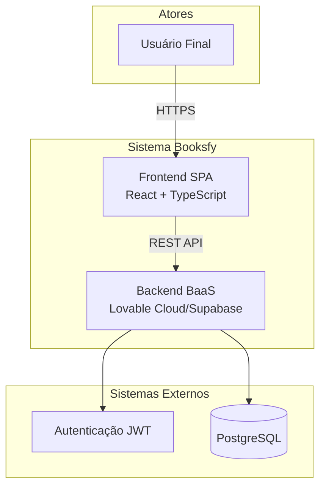

### 1.2 Características Principais

- **Arquitetura:** Single Page Application (SPA)
- **Pattern:** Client-Server com Backend-as-a-Service (BaaS)
- **Segurança:** Row Level Security (RLS) em 100% das tabelas
- **Estado:** Gerenciamento reativo com TanStack Query
- **UI/UX:** Design responsivo com tema escuro literário
- **Autenticação:** JWT-based com sessões gerenciadas

---

## 2. Modelo Arquitetural

### 2.1 Padrão Arquitetural

**Tipo:** Single Page Application (SPA)  
**Padrão:** Client-Server com Backend-as-a-Service  
**Arquitetura:** Baseada em Componentes (React)

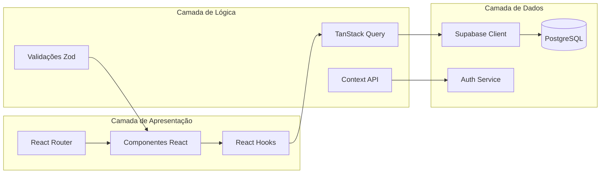

### 2.2 Arquitetura de 3 Camadas

1. **Camada de Apresentação (Presentation Layer)**
   - Componentes React
   - Páginas e rotas
   - UI components (shadcn/ui)
   - Estilização (Tailwind CSS)

2. **Camada de Lógica de Negócio (Business Logic Layer)**
   - Hooks customizados
   - TanStack Query (cache e sincronização)
   - Validações (React Hook Form + Zod)
   - Contextos (AppContext para autenticação)

3. **Camada de Dados (Data Layer)**
   - Supabase Client
   - PostgreSQL Database
   - Row Level Security (RLS)
   - Triggers e Functions

---

## 3. Arquitetura Frontend

### 3.1 Visão Geral

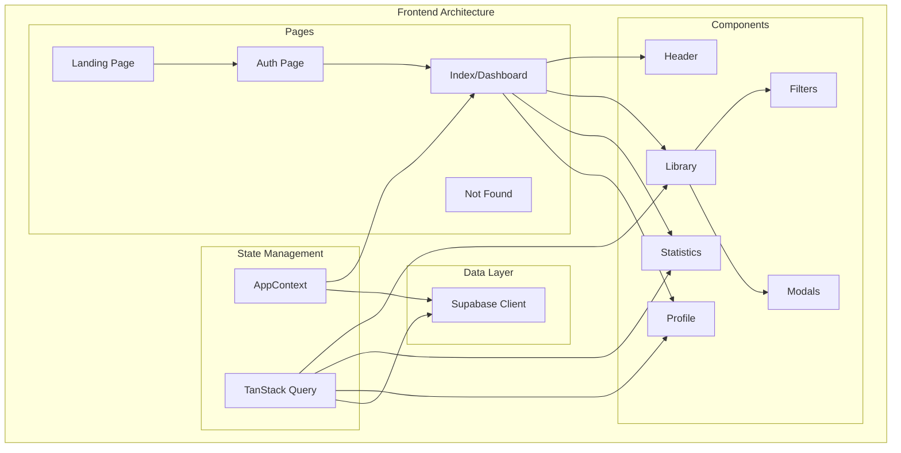

### 3.2 Stack Tecnológico Frontend

| Tecnologia | Versão | Propósito |
|------------|--------|-----------|
| React | ^18.3.1 | Framework UI |
| TypeScript | ^5.x | Tipagem estática |
| Vite | ^5.x | Build tool e dev server |
| React Router DOM | ^6.30.1 | Roteamento SPA |
| Tailwind CSS | ^3.x | Framework CSS utilitário |
| shadcn/ui | - | Biblioteca de componentes |
| TanStack Query | ^5.83.0 | Gerenciamento de estado servidor |
| React Hook Form | ^7.61.1 | Gerenciamento de formulários |
| Zod | ^3.25.76 | Validação de schemas |
| Recharts | ^2.15.4 | Visualização de dados |
| Lucide React | ^0.462.0 | Biblioteca de ícones |

### 3.3 Estrutura de Diretórios

```
src/
├── components/          # Componentes reutilizáveis
│   ├── ui/             # Componentes base (shadcn/ui)
│   ├── AddBookModal.tsx
│   ├── BookCard.tsx
│   ├── BookDetailsModal.tsx
│   ├── CharacterCounter.tsx
│   ├── GenreSelect.tsx
│   ├── Header.tsx
│   ├── Library.tsx
│   ├── LibraryFilters.tsx
│   ├── LibrarySkeleton.tsx
│   ├── Profile.tsx
│   └── Statistics.tsx
├── pages/              # Páginas da aplicação
│   ├── Auth.tsx
│   ├── Index.tsx
│   ├── Landing.tsx
│   └── NotFound.tsx
├── contexts/           # Contextos React
│   └── AppContext.tsx
├── hooks/              # Hooks customizados
│   ├── use-mobile.tsx
│   └── use-toast.ts
├── integrations/       # Integrações externas
│   └── supabase/
│       ├── client.ts
│       └── types.ts
├── lib/                # Utilitários
│   └── utils.ts
├── index.css           # Estilos globais
└── main.tsx            # Entry point
```

### 3.4 Fluxo de Dados Frontend

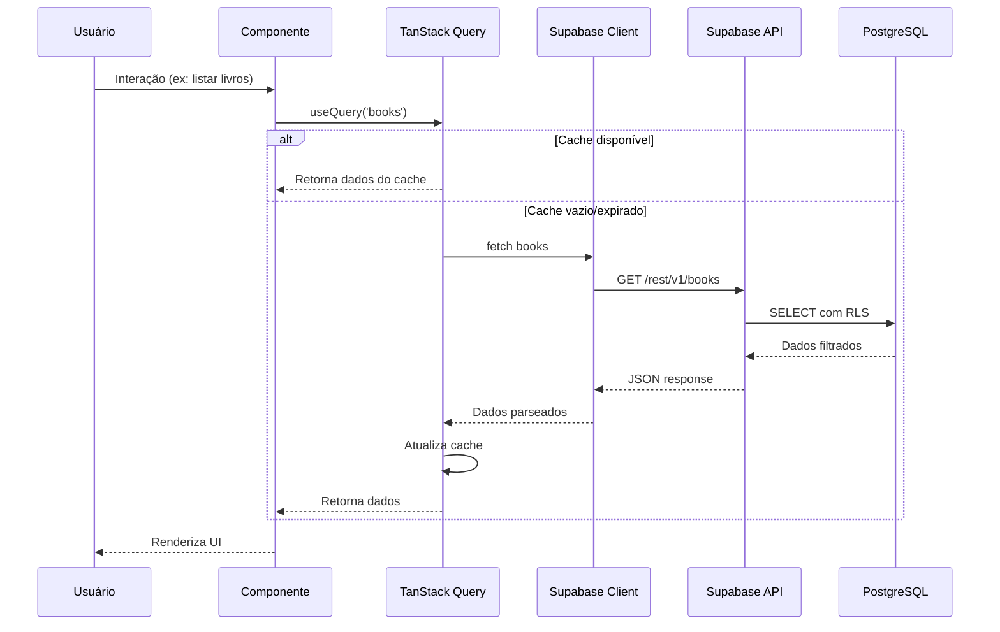

### 3.5 Gerenciamento de Estado

**Estado Global:**
- `AppContext`: Autenticação (user, session, loading)
- `TanStack Query`: Cache de dados do servidor

**Estado Local:**
- `useState`: Estado de componentes individuais
- `React Hook Form`: Estado de formulários

**Persistência:**
- `localStorage`: Session tokens (gerenciado pelo Supabase)
- TanStack Query cache (memória)

---

## 4. Arquitetura Backend

### 4.1 Visão Geral

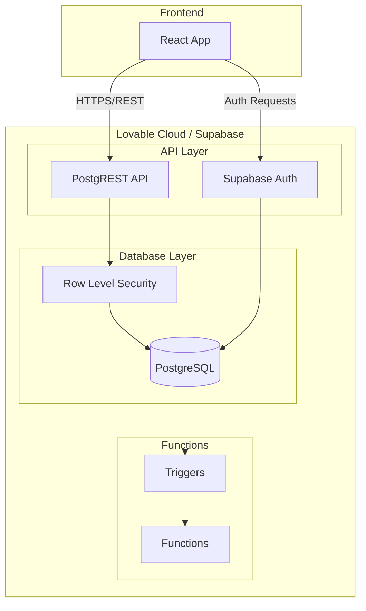

### 4.2 Supabase PostgREST API

O backend utiliza **PostgREST**, que automaticamente gera uma API RESTful a partir do schema PostgreSQL.

**Endpoints Automáticos:**
```
GET    /rest/v1/books              # Listar livros
POST   /rest/v1/books              # Criar livro
PATCH  /rest/v1/books?id=eq.{id}   # Atualizar livro
DELETE /rest/v1/books?id=eq.{id}   # Deletar livro

GET    /rest/v1/categories         # Listar categorias
GET    /rest/v1/profiles           # Perfil do usuário
GET    /rest/v1/reading_progress   # Progresso de leitura
```

**Características:**
- Filtros automáticos via query parameters
- Suporte a operadores: `eq`, `neq`, `gt`, `gte`, `lt`, `lte`, `like`, `ilike`, `in`
- Ordenação: `?order=title.asc`
- Paginação: `?limit=10&offset=0`
- Seleção de campos: `?select=id,title,author`

### 4.3 Autenticação (Supabase Auth)

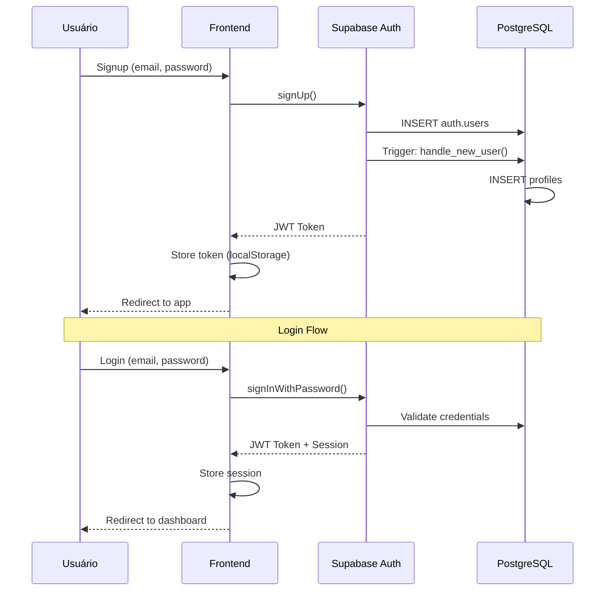

**Fluxo de Autenticação:**

1. **Signup:**
   - Usuário fornece email, senha e confirmação de senha
   - Frontend valida campos (Zod schema)
   - Supabase cria usuário em `auth.users`
   - Trigger `handle_new_user()` cria registro em `profiles`
   - Retorna JWT token

2. **Login:**
   - Usuário fornece email e senha
   - Supabase valida credenciais
   - Retorna JWT token + refresh token
   - Tokens armazenados em localStorage

3. **Session Management:**
   - `AppContext` mantém estado de autenticação
   - `onAuthStateChange` listener atualiza estado
   - Auto-refresh de tokens antes da expiração
   - Logout limpa localStorage e redireciona

### 4.4 Row Level Security (RLS)

Todas as tabelas implementam políticas RLS para garantir isolamento de dados:

```sql
-- Exemplo: Políticas da tabela books
CREATE POLICY "Users can view their own books"
ON public.books FOR SELECT
USING (auth.uid() = user_id);

CREATE POLICY "Users can create their own books"
ON public.books FOR INSERT
WITH CHECK (auth.uid() = user_id);

CREATE POLICY "Users can update their own books"
ON public.books FOR UPDATE
USING (auth.uid() = user_id);

CREATE POLICY "Users can delete their own books"
ON public.books FOR DELETE
USING (auth.uid() = user_id);
```

**Cobertura RLS:** 100% das tabelas com dados de usuário

---

## 5. Modelo de Dados

### 5.1 Diagrama Entidade-Relacionamento (ERD)

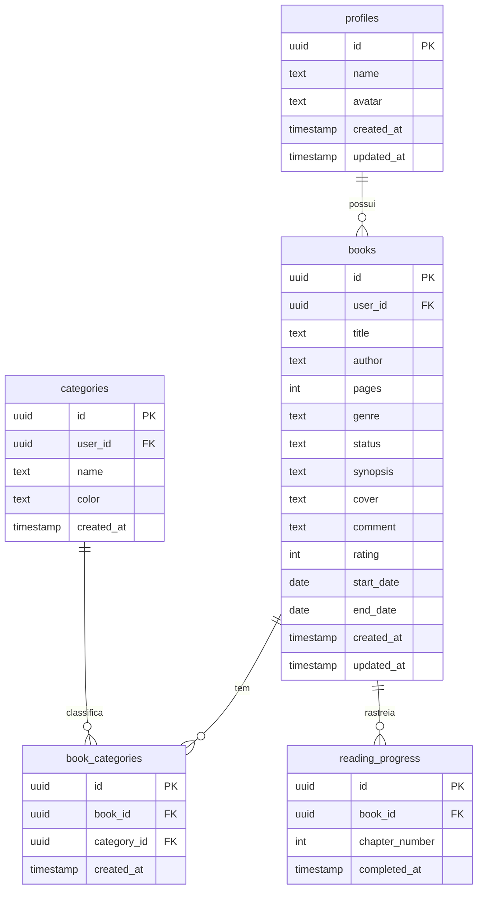

### 5.2 Descrição das Tabelas

#### 5.2.1 `profiles`

Armazena informações adicionais dos usuários.

| Coluna | Tipo | Constraints | Descrição |
|--------|------|-------------|-----------|
| id | uuid | PK, FK → auth.users | ID do usuário |
| name | text | NOT NULL | Nome de exibição |
| avatar | text | NULL | URL do avatar |
| created_at | timestamp | DEFAULT now() | Data de criação |
| updated_at | timestamp | DEFAULT now() | Data de atualização |

**RLS Policies:**
- SELECT: `auth.uid() = id`
- INSERT: `auth.uid() = id`
- UPDATE: `auth.uid() = id`
- DELETE: Não permitido

#### 5.2.2 `books`

Tabela principal de livros do usuário.

| Coluna | Tipo | Constraints | Descrição |
|--------|------|-------------|-----------|
| id | uuid | PK | ID do livro |
| user_id | uuid | FK, NOT NULL | ID do proprietário |
| title | text | NOT NULL, max 128 | Título do livro |
| author | text | NOT NULL, max 64 | Nome do autor |
| pages | integer | NULL, max 4 dígitos | Quantidade de páginas |
| genre | text | NULL | Gênero(s) do livro |
| status | text | NOT NULL | 'Lido', 'Lendo', 'Quero ler' |
| synopsis | text | NULL, max 1024 | Sinopse |
| cover | text | NULL | URL da capa |
| comment | text | NULL, max 1024 | Comentário pessoal |
| rating | integer | NULL, 1-5 | Avaliação em estrelas |
| start_date | date | NULL | Data de início |
| end_date | date | NULL | Data de término |
| created_at | timestamp | DEFAULT now() | Data de criação |
| updated_at | timestamp | DEFAULT now() | Data de atualização |

**Validações:**
- `end_date` >= `start_date` (quando ambos definidos)
- `rating` entre 1 e 5
- `status` em ['Lido', 'Lendo', 'Quero ler']

**RLS Policies:**
- Todas operações: `auth.uid() = user_id`

#### 5.2.3 `categories`

Categorias personalizadas de usuário.

| Coluna | Tipo | Constraints | Descrição |
|--------|------|-------------|-----------|
| id | uuid | PK | ID da categoria |
| user_id | uuid | FK, NULL | ID do usuário (NULL = sistema) |
| name | text | NOT NULL | Nome da categoria |
| color | text | NOT NULL | Cor em hex |
| created_at | timestamp | DEFAULT now() | Data de criação |

**RLS Policies:**
- SELECT: `auth.uid() = user_id OR user_id IS NULL`
- INSERT/UPDATE/DELETE: `auth.uid() = user_id`

#### 5.2.4 `book_categories`

Relacionamento many-to-many entre livros e categorias.

| Coluna | Tipo | Constraints | Descrição |
|--------|------|-------------|-----------|
| id | uuid | PK | ID do relacionamento |
| book_id | uuid | FK, NOT NULL | ID do livro |
| category_id | uuid | FK, NOT NULL | ID da categoria |
| created_at | timestamp | DEFAULT now() | Data de criação |

**RLS Policies:**
- Todas operações: Verifica ownership via `books.user_id`

#### 5.2.5 `reading_progress`

Acompanhamento de progresso por capítulo.

| Coluna | Tipo | Constraints | Descrição |
|--------|------|-------------|-----------|
| id | uuid | PK | ID do progresso |
| book_id | uuid | FK, NOT NULL | ID do livro |
| chapter_number | integer | NOT NULL | Número do capítulo |
| completed_at | timestamp | DEFAULT now() | Data de conclusão |

**RLS Policies:**
- Todas operações: Verifica ownership via `books.user_id`

### 5.3 Triggers e Functions

#### Function: `update_updated_at_column()`

```sql
CREATE OR REPLACE FUNCTION public.update_updated_at_column()
RETURNS TRIGGER AS $$
BEGIN
  NEW.updated_at = NOW();
  RETURN NEW;
END;
$$ LANGUAGE plpgsql SET search_path = public;
```

**Uso:** Atualiza automaticamente `updated_at` nas tabelas `profiles` e `books`.

#### Function: `handle_new_user()`

```sql
CREATE OR REPLACE FUNCTION public.handle_new_user()
RETURNS TRIGGER AS $$
BEGIN
  INSERT INTO public.profiles (id, name)
  VALUES (
    NEW.id,
    COALESCE(NEW.raw_user_meta_data->>'name', 'Leitor')
  );
  RETURN NEW;
END;
$$ LANGUAGE plpgsql SECURITY DEFINER SET search_path = 'public';
```

**Uso:** Cria automaticamente um perfil quando um novo usuário se registra.

---

## 6. Fluxos do Sistema

### 6.1 Fluxo de Autenticação Completo

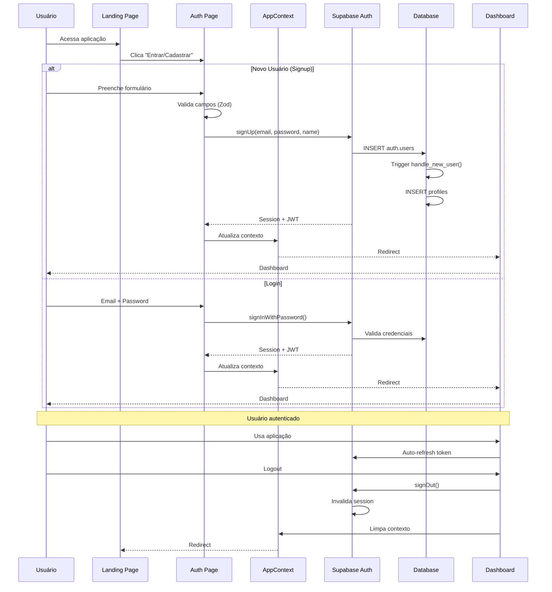

### 6.2 Fluxo de Criação de Livro

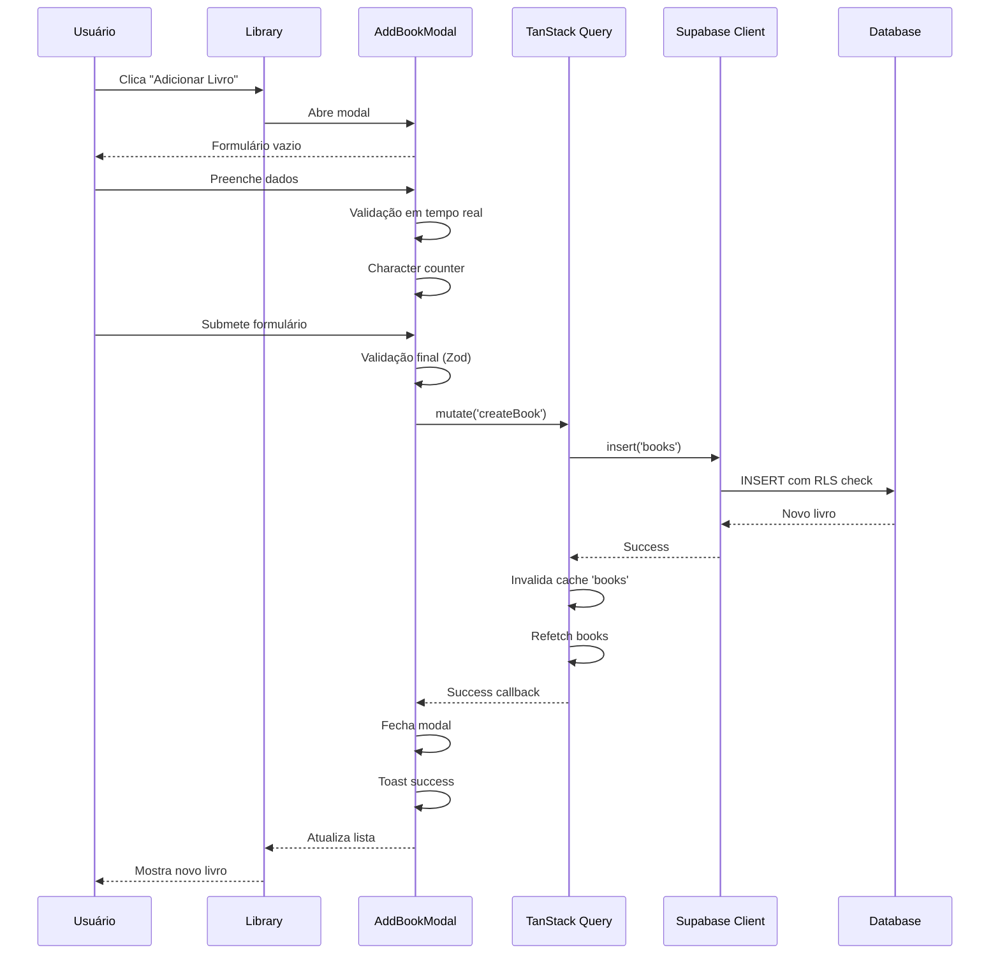

### 6.3 Fluxo de Filtros e Pesquisa

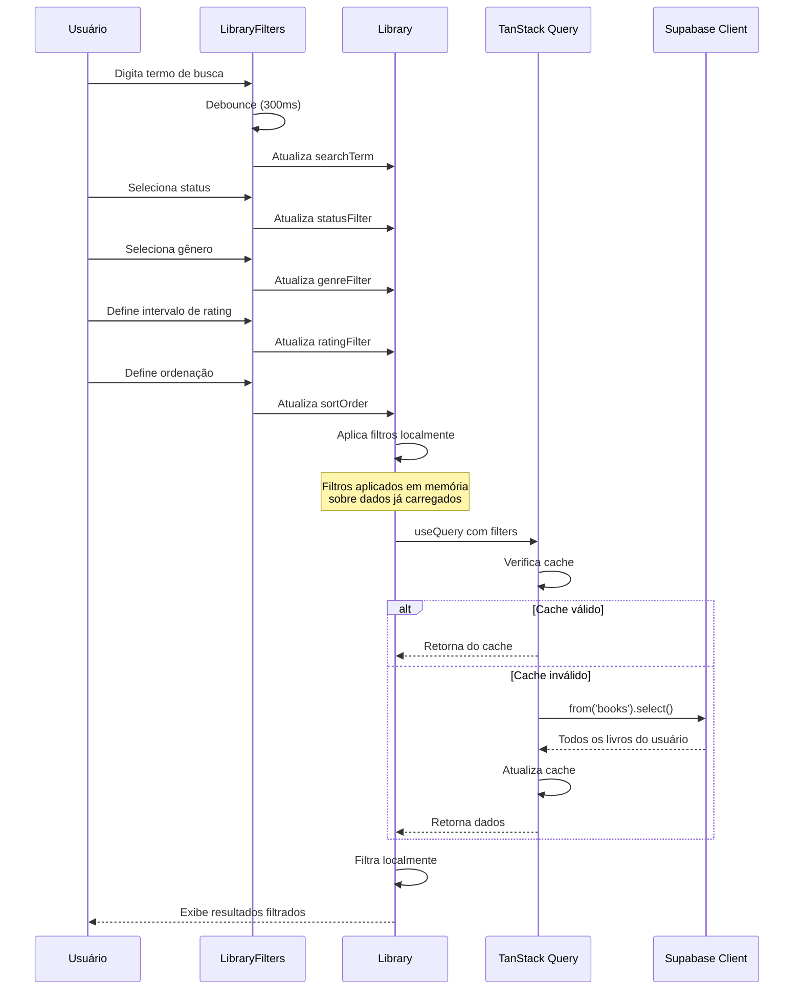

### 6.4 Fluxo de Edição de Livro

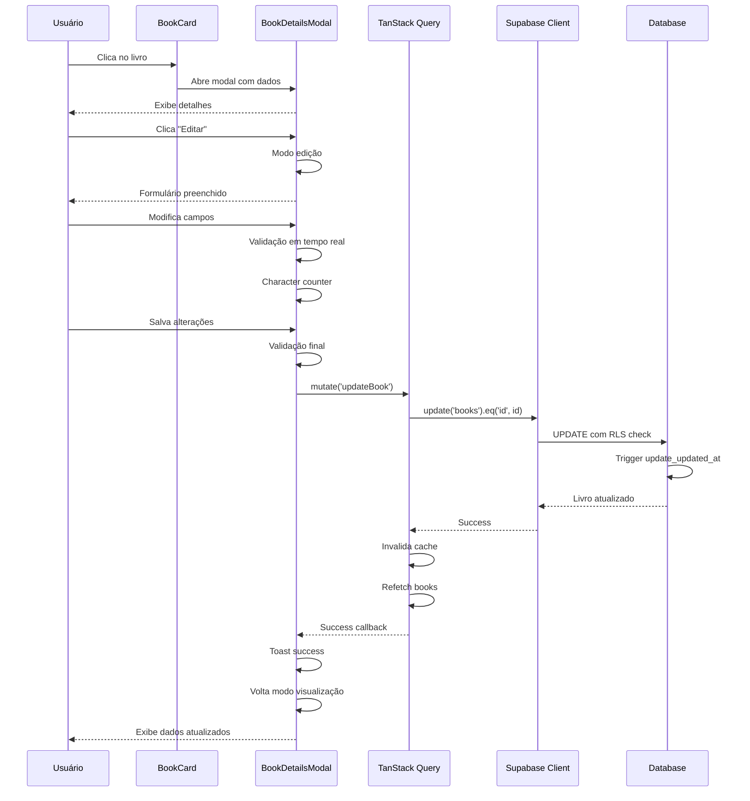

---

## 7. Camada de Segurança

### 7.1 Arquitetura de Segurança em Camadas

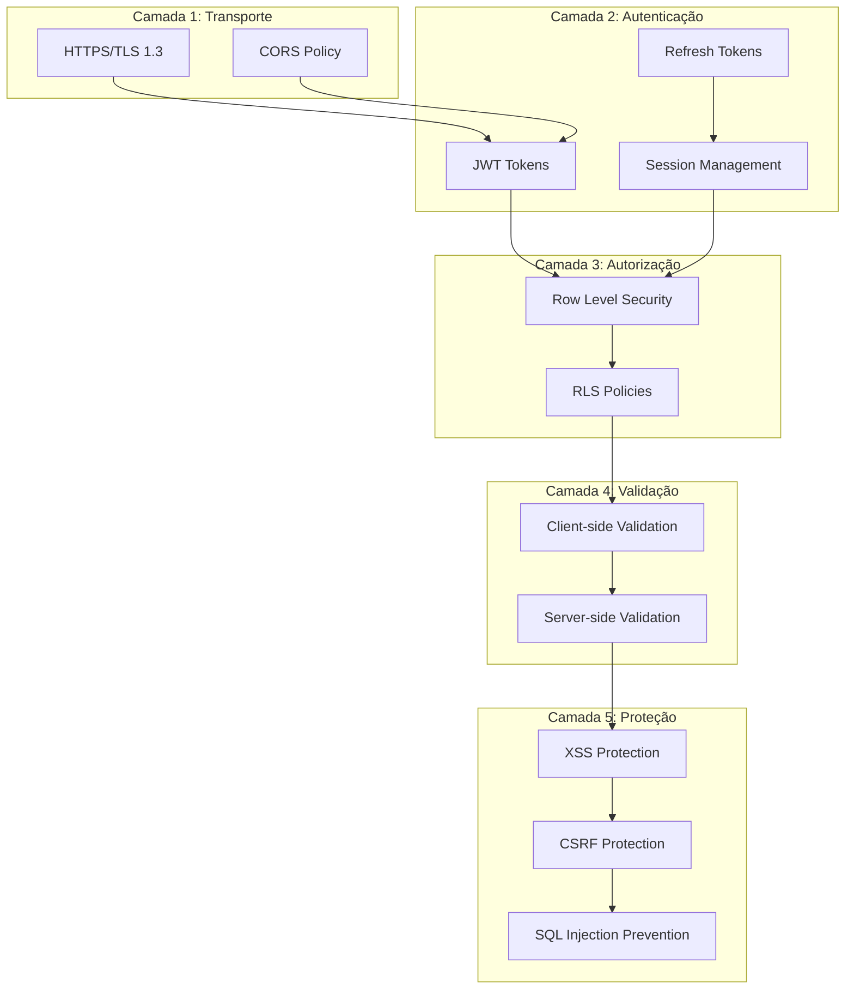

### 7.2 Segurança em Nível de Transporte

**HTTPS/TLS:**
- Todas as comunicações criptografadas
- TLS 1.3 (mínimo 1.2)
- Certificados SSL válidos

**CORS:**
- Configurado para domínio específico
- Métodos HTTP restritos
- Headers controlados

### 7.3 Autenticação e Sessões

**JWT Tokens:**
```json
{
  "sub": "user-uuid",
  "role": "authenticated",
  "iat": 1700000000,
  "exp": 1700003600
}
```

**Características:**
- Expiração: 1 hora
- Refresh token: 7 dias
- Auto-refresh antes da expiração
- Armazenamento seguro (httpOnly cookies ou localStorage)

**Session Management:**
- `onAuthStateChange` listener
- Validação automática de token
- Logout em caso de token inválido
- Proteção contra session fixation

### 7.4 Row Level Security (RLS)

**Política de Isolamento Total:**

Cada usuário só acessa seus próprios dados através de políticas RLS:

```sql
-- Exemplo: books table
CREATE POLICY "Users can view their own books"
ON public.books FOR SELECT
USING (auth.uid() = user_id);

CREATE POLICY "Users can create their own books"
ON public.books FOR INSERT
WITH CHECK (auth.uid() = user_id);

CREATE POLICY "Users can update their own books"
ON public.books FOR UPDATE
USING (auth.uid() = user_id);

CREATE POLICY "Users can delete their own books"
ON public.books FOR DELETE
USING (auth.uid() = user_id);
```

**Tabelas com RLS:**
- ✅ `profiles` - 100% protegido
- ✅ `books` - 100% protegido
- ✅ `categories` - Protegido + categorias públicas do sistema
- ✅ `book_categories` - Protegido via books
- ✅ `reading_progress` - Protegido via books

### 7.5 Validação de Dados

**Client-side (React Hook Form + Zod):**

```typescript
const bookSchema = z.object({
  title: z.string().min(1, 'Título obrigatório').max(128, 'Máximo 128 caracteres'),
  author: z.string().min(1, 'Autor obrigatório').max(64, 'Máximo 64 caracteres'),
  pages: z.number().optional().refine(val => !val || val <= 9999, 'Máximo 4 dígitos'),
  synopsis: z.string().max(1024, 'Máximo 1024 caracteres').optional(),
  comment: z.string().max(1024, 'Máximo 1024 caracteres').optional(),
  rating: z.number().min(1).max(5).optional(),
  status: z.enum(['Lido', 'Lendo', 'Quero ler']),
  start_date: z.date().optional(),
  end_date: z.date().optional(),
}).refine(
  (data) => {
    if (data.start_date && data.end_date) {
      return data.end_date >= data.start_date;
    }
    return true;
  },
  { message: 'Data de término não pode ser anterior à data de início' }
);
```

**Server-side (PostgreSQL Constraints):**
- NOT NULL constraints
- CHECK constraints
- Foreign key constraints
- Unique constraints
- Data type validation

### 7.6 Proteção contra Ataques

**XSS (Cross-Site Scripting):**
- React auto-escaping de strings
- Sanitização de HTML quando necessário
- Content Security Policy (CSP)
- Sem `dangerouslySetInnerHTML`

**CSRF (Cross-Site Request Forgery):**
- JWT em header Authorization
- SameSite cookies
- Origin validation

**SQL Injection:**
- Prepared statements automáticos (Supabase Client)
- Parametrização de queries
- Sem concatenação de strings em SQL
- RLS como camada adicional

**Password Security:**
- Mínimo 6 caracteres (recomendado 8+)
- Bcrypt hash (Supabase Auth)
- Rate limiting em tentativas de login
- Proteção contra leaked passwords

### 7.7 Medidas de Segurança Implementadas

✅ **Autenticação obrigatória com verificação de email**  
✅ **Row Level Security em 100% das tabelas**  
✅ **Validação client-side e server-side**  
✅ **Proteção contra SQL Injection via prepared statements**  
✅ **Proteção XSS via React auto-escaping**  
✅ **HTTPS obrigatório em produção**  
✅ **JWT tokens com expiração**  
✅ **Password hashing com bcrypt**  
✅ **CORS configurado**  
✅ **Validação de limites de caracteres**  
✅ **Search path seguro em functions**  
✅ **Proteção contra leaked passwords**  

---

## 8. Integrações Externas

### 8.1 Lovable Cloud / Supabase

**Serviços Utilizados:**
- **Database:** PostgreSQL 15
- **Auth:** Supabase Auth (JWT-based)
- **Realtime:** Não utilizado no momento
- **Storage:** Não utilizado (URLs externas para capas)

**Configuração:**
```typescript
// src/integrations/supabase/client.ts
export const supabase = createClient<Database>(
  import.meta.env.VITE_SUPABASE_URL,
  import.meta.env.VITE_SUPABASE_PUBLISHABLE_KEY,
  {
    auth: {
      storage: localStorage,
      persistSession: true,
      autoRefreshToken: true,
    }
  }
);
```

### 8.2 TanStack Query (React Query)

**Configuração:**
```typescript
const queryClient = new QueryClient({
  defaultOptions: {
    queries: {
      staleTime: 5 * 60 * 1000, // 5 minutos
      cacheTime: 10 * 60 * 1000, // 10 minutos
      retry: 1,
      refetchOnWindowFocus: false,
    },
  },
});
```

**Uso:**
- Cache de dados do servidor
- Sincronização automática
- Invalidação inteligente
- Optimistic updates

### 8.3 shadcn/ui

**Componentes Utilizados:**
- Button, Card, Dialog, Input, Label
- Select, Textarea, Tabs, Toast
- Accordion, Alert, Badge, Calendar
- Checkbox, Dropdown Menu, Popover
- Progress, Skeleton, Switch, Tooltip

**Customização:**
- Tailwind CSS tokens
- Tema escuro literário
- Variantes personalizadas

### 8.4 Recharts

**Gráficos Implementados:**
- Gráfico de barras (livros por status)
- Gráfico de linha (leitura ao longo do tempo)
- Estatísticas agregadas

---

## 9. Deploy e Infraestrutura

### 9.1 Fluxo de Deploy

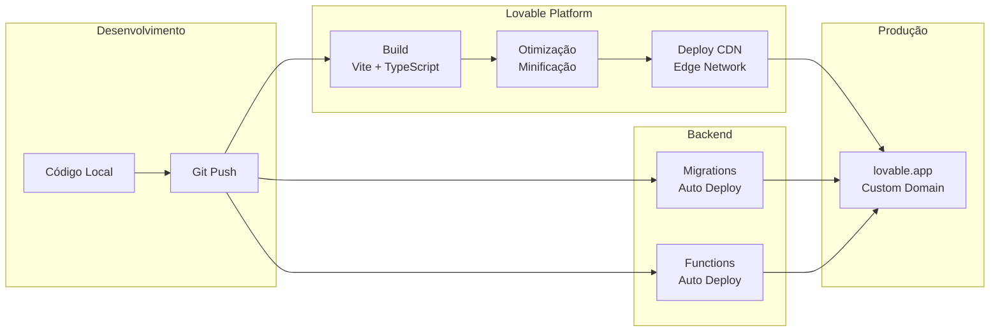

### 9.2 Ambientes

**Desenvolvimento:**
- `npm run dev` (Vite dev server)
- Hot Module Replacement (HMR)
- Source maps completos
- Supabase local ou staging

**Produção:**
- Build otimizado (`npm run build`)
- Minificação de JS/CSS
- Tree shaking
- Code splitting
- Compression (gzip/brotli)
- CDN global

### 9.3 Build de Produção

**Processo:**
```bash
# 1. Instalar dependências
npm install

# 2. Validar tipos TypeScript
npx tsc --noEmit

# 3. Build otimizado
npm run build

# 4. Output em dist/
# - HTML minificado
# - JS bundled e minificado
# - CSS otimizado
# - Assets com hash
```

**Estrutura de Output:**
```
dist/
├── index.html
├── assets/
│   ├── index-[hash].js
│   ├── index-[hash].css
│   └── [images/fonts]
└── robots.txt
```

### 9.4 Variáveis de Ambiente

**Necessárias:**
```env
VITE_SUPABASE_URL=https://xdorhvhzphjporiisjlu.supabase.co
VITE_SUPABASE_PUBLISHABLE_KEY=eyJhbGci...
VITE_SUPABASE_PROJECT_ID=xdorhvhzphjporiisjlu
```

**Gerenciamento:**
- `.env` para desenvolvimento
- Lovable platform secrets para produção
- Nunca commitar no Git
- Usar `import.meta.env.VITE_*` no código

### 9.5 Monitoramento

**Frontend:**
- Erros de runtime: Console browser
- Network requests: DevTools
- Performance: Lighthouse

**Backend:**
- Logs: Lovable Cloud dashboard
- Database: Supabase dashboard
- Auth: Supabase Auth logs
- API: PostgREST logs

---

## 10. Performance e Escalabilidade

### 10.1 Otimizações de Performance

**Build Time:**
- ✅ Tree shaking (Vite)
- ✅ Minificação de JS/CSS
- ✅ Code splitting por rota
- ✅ Asset optimization
- ✅ CSS purging (Tailwind)

**Runtime:**
- ✅ TanStack Query caching (5 min stale time)
- ✅ Debouncing em inputs de busca (300ms)
- ✅ Skeleton loaders
- ✅ Lazy loading de rotas
- ✅ Optimistic updates
- ✅ Memoização de componentes (React.memo)

**Network:**
- ✅ Compression (gzip/brotli)
- ✅ CDN para assets estáticos
- ✅ HTTP/2
- ✅ Supabase PostgREST otimizado
- ✅ Queries eficientes (select específico)
- ✅ Paginação quando necessário

### 10.2 Métricas de Performance

**Target Metrics (Lighthouse):**
- Performance: > 90
- Accessibility: > 95
- Best Practices: > 95
- SEO: > 90

**Core Web Vitals:**
- LCP (Largest Contentful Paint): < 2.5s
- FID (First Input Delay): < 100ms
- CLS (Cumulative Layout Shift): < 0.1

### 10.3 Escalabilidade

**Limites Atuais:**
- Supabase Free Tier:
  - 500 MB de database
  - 1 GB de bandwidth/mês
  - 50 MB de storage
  - 2 conexões simultâneas

**Escalabilidade Vertical (Supabase):**
- Pro Plan: 8 GB DB, 50 GB bandwidth
- Dedicated instances para alta carga

**Escalabilidade Horizontal:**
- Frontend: CDN distribui carga globalmente
- Backend: Supabase auto-scaling
- Database: Read replicas (Pro+)

### 10.4 Limitações Conhecidas

1. **Filtros em memória:**
   - Todos os livros carregados de uma vez
   - Pode ser lento com 1000+ livros
   - Solução futura: Filtros server-side

2. **Sem paginação:**
   - Biblioteca grande pode ter performance ruim
   - Solução futura: Infinite scroll

3. **Sem compressão de imagens:**
   - URLs externas não otimizadas
   - Solução futura: Storage próprio + transformação

4. **Sem offline support:**
   - Requer conexão para funcionar
   - Solução futura: PWA + Service Worker

### 10.5 Roadmap de Performance

**Curto Prazo:**
- [ ] Implementar paginação
- [ ] Filtros server-side
- [ ] Image lazy loading
- [ ] Virtualização de listas longas

**Médio Prazo:**
- [ ] PWA (Progressive Web App)
- [ ] Service Worker para cache offline
- [ ] Compressão de imagens (Supabase Storage)
- [ ] Analytics de performance

**Longo Prazo:**
- [ ] Otimização de bundle size
- [ ] React Server Components (Next.js migration?)
- [ ] Database read replicas
- [ ] CDN para assets de usuário

---

## Conclusão

A arquitetura do Booksfy foi projetada para ser:

- **Simples:** SPA com React e BaaS (Supabase)
- **Segura:** RLS em 100% das tabelas, validação em camadas
- **Escalável:** Preparada para crescimento vertical e horizontal
- **Performática:** Otimizações de build e runtime
- **Manutenível:** Código organizado, tipado e testável

O sistema atende aos requisitos funcionais e não-funcionais definidos, com foco em experiência do usuário, segurança de dados e facilidade de manutenção.

---

**Documento criado em:** 23/11/2025  
**Versão:** 1.0  
**Autor:** Equipe Booksfy  
**Última atualização:** 23/11/2025
